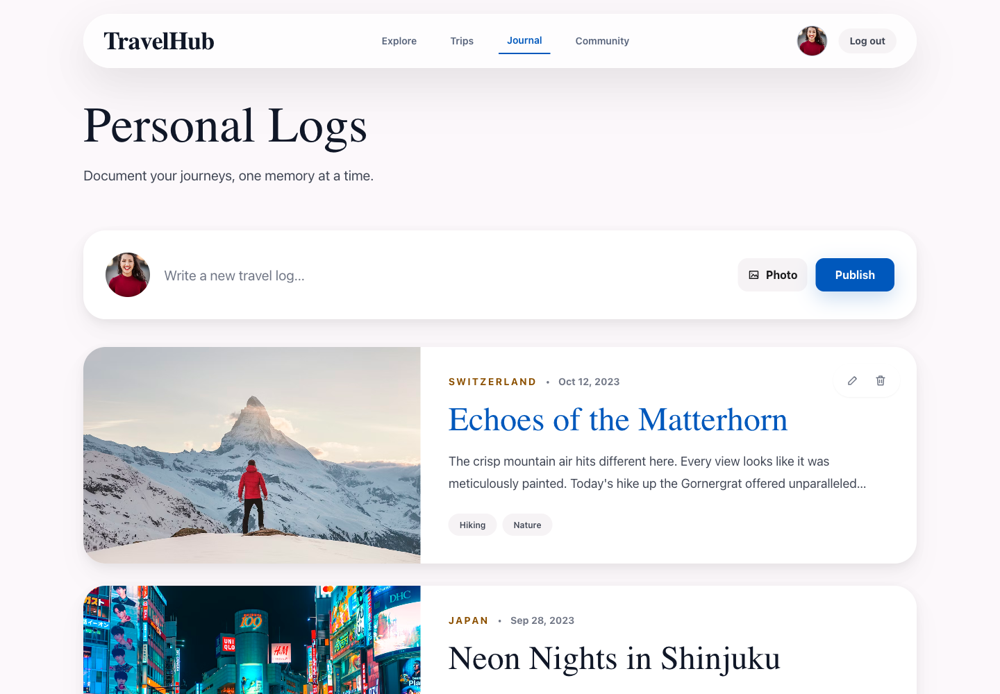
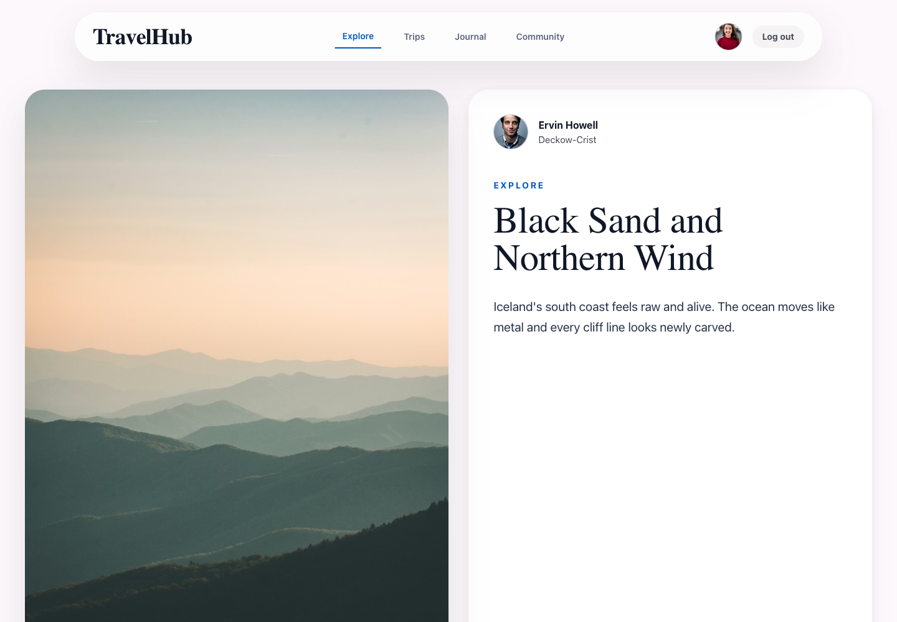
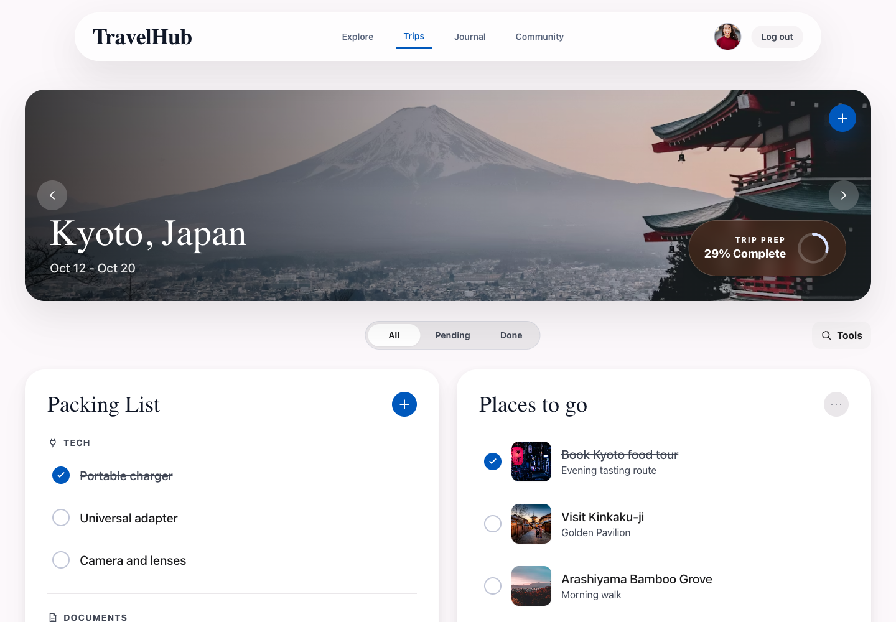
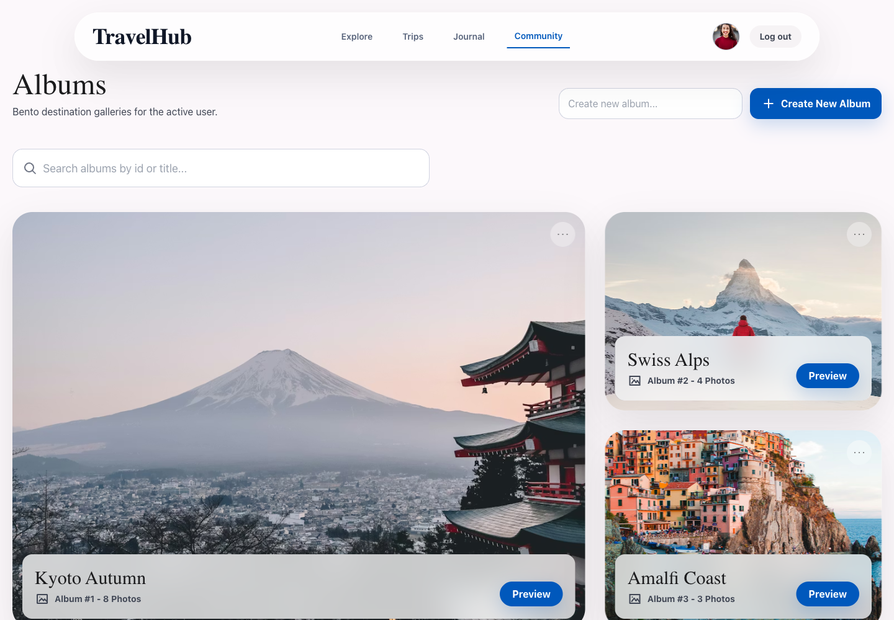
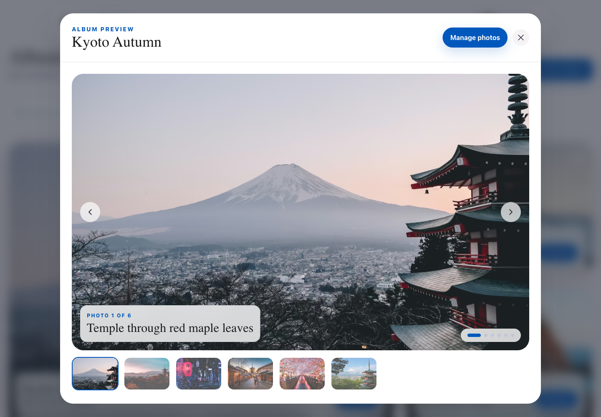

# TravelHub

TravelHub is a fullstack travel social app built for the Advanced React REST API project. It combines an Instagram-style explore feed, a personal travel journal, trip planning tools, destination albums, authentication, protected routes, and a local REST backend powered by JSON Server.



## Preview

| Explore Feed | Trip Planner |
| --- | --- |
|  |  |

| Albums | Album Preview |
| --- | --- |
|  |  |

## Tech Stack

- React 18 with Vite
- React Router DOM
- Tailwind CSS
- JSON Server `0.17.4`
- Local Storage session persistence
- REST-style CRUD with a small in-memory GET cache

## Core Features

- Authentication with login, two-step registration, logout, and refresh persistence.
- Protected routes that redirect guests to `/login`.
- User route guarding so one user cannot browse another user route directly.
- Profile info drawer with user details and avatar.
- App navigation: Explore, Trips, Journal, Community, and Log out.
- Explore feed that shows other travelers' posts one at a time.
- Explore post photo carousel where arrows switch photos, not posts.
- Likes, comments, reshares, and comment avatars.
- Personal journal page for the active user's own travel logs.
- Create posts with uploaded cover photos or image URLs.
- Trip planner with trip carousel, packing list, and "Places to go".
- Packing categories menu for labels like Tech, Documents, Clothing, Health, Money, and more.
- Places can include a name, note, and image URL.
- Albums grid with preview carousel and a separate photo management view.
- Paginated photo loading with `_page` and `_limit`.
- Loading, empty, error, and unauthorized states.

## Assignment Coverage

The app uses JSONPlaceholder-style resources locally and implements the required project entities:

- `users`
- `todos`
- `posts`
- `comments`
- `albums`
- `photos`

User-owned reads are filtered by the active `userId`, and user-owned creates attach the active user automatically. The login password is stored in the `website` field, matching the assignment requirement.

## Getting Started

Install dependencies:

```bash
npm install
```

Run the local REST API:

```bash
npm run server
```

Run the React app in a second terminal:

```bash
npm run dev
```

Open the Vite URL:

```text
http://127.0.0.1:5173
```

## Demo Login

```text
Username: Bret
Password: hildegard.org
```

The app stores the active session in Local Storage under:

```text
travelhub.activeUserId
```

## Routes

```text
/login
/register
/register/details
/home
/users/:userId/todos
/users/:userId/posts
/users/:userId/posts/:postId
/users/:userId/albums
/users/:userId/albums/:albumId/photos
```

## API

The frontend talks to JSON Server at:

```text
http://127.0.0.1:3001
```

Shared API methods:

```js
api.get(path, { cache })
api.post(path, body)
api.patch(path, body)
api.delete(path)
```

GET requests can be cached by URL. Mutations invalidate affected cache keys so the UI refreshes after create, update, or delete actions.

## Project Structure

```text
src/
  components/      App shell, icons, profile drawer, status states
  context/         Auth provider and session logic
  data/            Travel image helpers
  lib/             API client and cache
  pages/           Login, register, feed, journal, trips, albums, photos
db.json            Local JSON Server database
docs/screenshots/  README screenshots captured from the running app
```

## Validation

Before submitting, run:

```bash
npm run build
```

The project is designed for local development with Vite on port `5173` and JSON Server on port `3001`.
